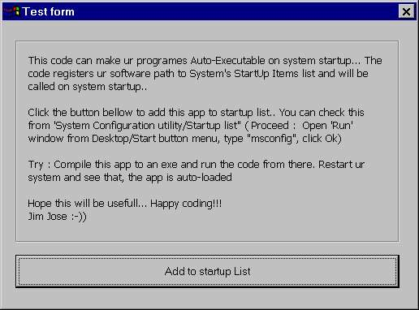



## How to make your software Auto\-Executable on System startUp\!\!\!\(?\)

### Description

A simple and useful code... You can make your software AUTO-EXECUTABLE on SYSTEM STARTUP. This code can register the execution path to System's startuplist. You can also ENABLE and DISABLE this feature. You can use the same code to add any other Softwares/File to the startup list.... Any positive response from u is appreciated... Happy coding!!!  Jim Jose :-))
 
### More Info
 

             |
---                |---
**Submitted On**   |2005-07-07 00:14:50
**By**             |[JJJJJJJJ](https://github.com/Planet-Source-Code/PSCIndex/blob/master/ByAuthor/jjjjjjjj.md)
**Level**          |Intermediate
**User Rating**    |5.0 (10 globes from 2 users)
**Compatibility**  |VB 6\.0
**Category**       |[Files/ File Controls/ Input/ Output](https://github.com/Planet-Source-Code/PSCIndex/blob/master/ByCategory/files-file-controls-input-output__1-3.md)
**World**          |[Visual Basic](https://github.com/Planet-Source-Code/PSCIndex/blob/master/ByWorld/visual-basic.md)
**Archive File**   |[How\_to\_mak1912817132005\.zip](https://github.com/Planet-Source-Code/jjjjjjjj-how-to-make-your-software-auto-executable-on-system-startup__1-61678/archive/master.zip)

